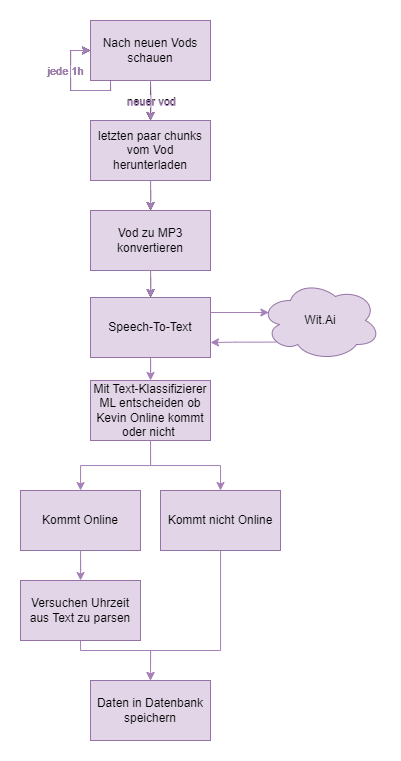

# KommtKevinOnline.de Worker

This is the worker for kommtkevinonline.de.

The worker listens to Twitch EventSub over websocket:

- **stream.online** — records the actual stream start (for accuracy stats and "war heute schon Stream").
- **stream.offline** — downloads the last 5 minutes of the new VOD, transcribes it with OpenAI Whisper, and asks ChatGPT to extract predictions ("kommt Kevin morgen online, und wann?"). Predictions and the VOD (incl. transcript) are written to the shared Postgres database that the website reads.

Additionally, messages from a configured WhatsApp channel (text and voice) are run through the same prediction pipeline (`source: whatsapp`).

Prediction extraction runs as a small tool-calling agent (`ai/engine.go`): the model sees the current upcoming predictions plus the new input and maintains the table through validated tools (`upsert_prediction`, `clear_day`, `get_upcoming_predictions`). Every write is validated in Go (day must be within -1/+14 days of the input, times parsed, confidence clamped) and every attempt is stored in `prediction_runs` for auditing/replays. On hard failure of `OPENAI_MODEL` it escalates once to `OPENAI_ESCALATION_MODEL`.

Predictions are upserted per calendar day (Europe/Berlin): a newer announcement replaces the older one for the same day. Rows with `source = 'manual'` (edited via the website admin) are never overwritten by automated sources — enforced at the SQL layer, so no model output can bypass it. Predictions carry a confidence score and the verbatim quote (incl. VOD timestamp) they are based on.

### Usage
1. Copy the .env.example to .env
2. Insert missing values
3. Start the project:
```
docker-compose up
```

### Manual processing
`GET /manual?vodId=<id>&token=<MANUAL_API_TOKEN>` queues a VOD for (re-)processing. The route is disabled unless `MANUAL_API_TOKEN` is set.

### How does it work

